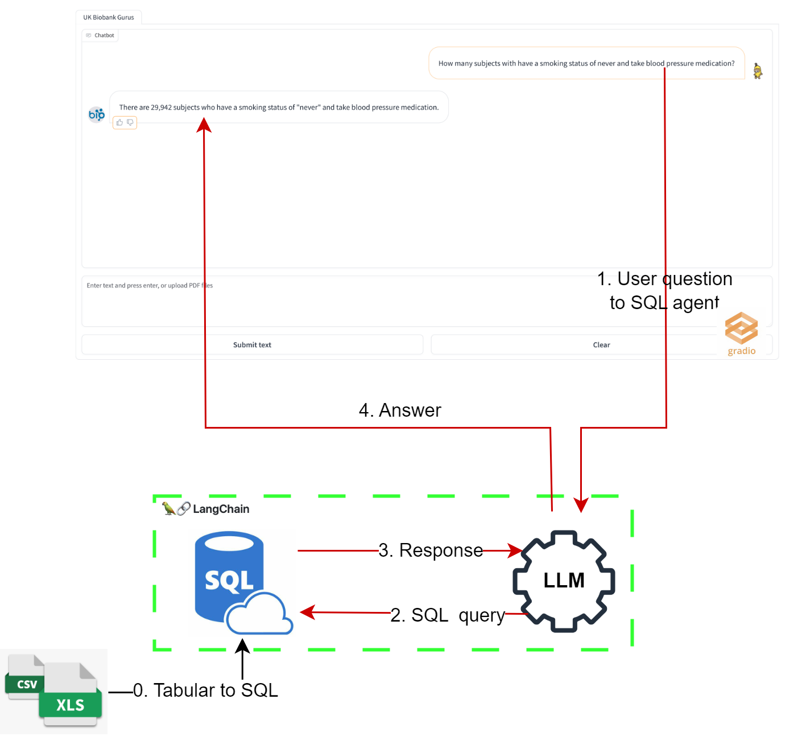
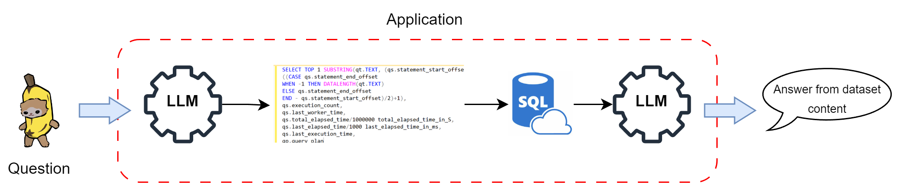

# BioBanksGurus - BIODS 295
This project has as scope the implementation of a large language model (LLM) to interact with the uk Biobank dataset.

The Chatbot will interpret the user commands as SQL commands for extracting the information from the database. The database is created from uploaded .csv and .xlsx files before the application is executed for interaction.   


## Models used in this chatbot:
- GPT 3.5: [Website](https://platform.openai.com/docs/models)

## Requirements: 
- OpenAI or Azure OpenAI Credentials: Required for GPT functionality.
- Windows/ Linux OS

## Installation:
- Create a python virtual environment and use the requirements.txt file for installing the libraries
- You will need to make a .env file in the root directory of the project and insert the following keys 
```
OPENAI_API_VERSION='<>'
OPENAI_API_BASE='<>'
OPENAI_API_KEY='<>'
gpt_deployment_name='<>'
```
- The fields for the .env file are taken from the names and keys you generate in the Azure OpenAI application and to the created model you want the projec to connect with. 

## Database:
- If you do not have the UK BioBank dataset, run the following scrip to create the Uk Biobank dummy dataset 
```
python explore/test_models/generate_dummy_ukbb_data.ipynb
```
- If you use other datasets, it's important to make the column name with self-explanatory names so we chatbot can understand what is being requested from the dataset. 

## Execution:
To prepare a SQL DB from your CSV and XLSX files, copy your files in `data/csv_xlsx` and in the terminal, from the project folder, execute:
```
python src/prepare_csv_xlsx_db.py.
```
This command will create a SQL database named `csv_xlsx_sqldb.db` in the `data` directory.
Once the .csv/.xlsx files are transformed to a single .db file we can then run the application with the command 
```
python src/app.py.
```

## Project Schema & GUI
<div align="center">
  
</div>

<div align="center">
  
</div>

## Key frameworks/libraries used in this chatbot:
- Langchain: [introduction](https://python.langchain.com/docs/get_started/introduction)
- Gradio: [Documentation](https://www.gradio.app/docs/interface)
- OpenAI: [Developer quickstart](https://platform.openai.com/docs/quickstart?context=python)
- SQLAlchemy [Documentation](https://www.sqlalchemy.org/)

# Acknowledgments 
This repository was created following the open source code and extremity helpful YouTube explanation of https://github.com/Farzad-R/LLM-Zero-to-Hundred?tab=readme-ov-file